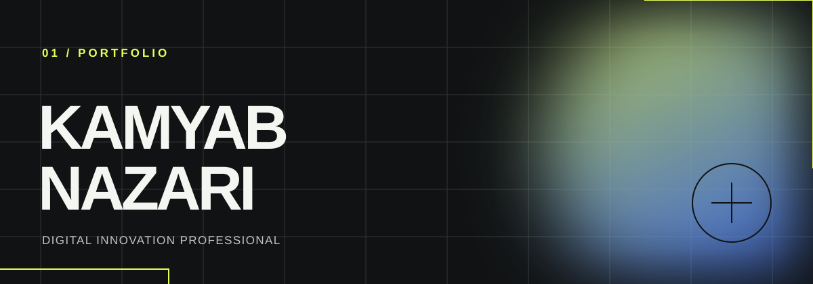

  

  <a href="https://www.kamyabnazari.com"><strong>Website</strong></a>
  &nbsp;·&nbsp;
  <a href="https://www.linkedin.com/in/kamyabnazari/"><strong>LinkedIn</strong></a>
  &nbsp;·&nbsp;
  <a href="mailto:contact@kamyabnazari.com"><strong>Email</strong></a>

  BERLIN, GERMANY &nbsp;—&nbsp; AI · WEB · GAMES

 

## Building toward potential

I’m Kamyab—a digital innovation professional building thoughtful software where **AI**, **open source**, and human curiosity meet. I work across machine learning, generative AI, full-stack web, and game development, with a consistent interest in tools that are practical, transparent, and better when shared.

> Everyone has a responsibility to reach one’s true potential.

### Selected work

<table>
  <tr>
    <td width="50%" valign="top">
      <h3><a href="https://github.com/kamyabnazari/genraft-ai">Genraft AI ↗</a></h3>
      
A Python toolkit for shaping sophisticated web solutions and conversational agents with the OpenAI API.

      
<code>Python</code> <code>OpenAI</code> <code>Generative AI</code>

    </td>
    <td width="50%" valign="top">
      <h3><a href="https://github.com/kamyabnazari/customer-service-classifier-ai">Customer Service Classifier AI ↗</a></h3>
      
An investigation into how LLMs can classify banking customer inquiries through prompt engineering and fine-tuning.

      
<code>GPT-3.5</code> <code>Prompt Engineering</code> <code>Research</code>

    </td>
  </tr>
  <tr>
    <td width="50%" valign="top">
      <h3><a href="https://github.com/kamyabnazari/fair-energy-ai">Fair Energy AI ↗</a></h3>
      
A demonstration of how AI systems used in energy management can be transparent and deliver fairer outcomes.

      
<code>Svelte</code> <code>AI</code> <code>Energy</code>

    </td>
    <td width="50%" valign="top">
      <h3><a href="https://github.com/kamyabnazari/epistle-engine">Epistle Engine ↗</a></h3>
      
A unified frontend and backend project exploring a cohesive application experience.

      
<code>Svelte</code> <code>Full-stack</code>

    </td>
  </tr>
</table>

 

### Working vocabulary

  
  
  
  
  
  

 

  <a href="https://www.kamyabnazari.com/projects">Explore the full project archive →</a>

  Open for anything interesting.

